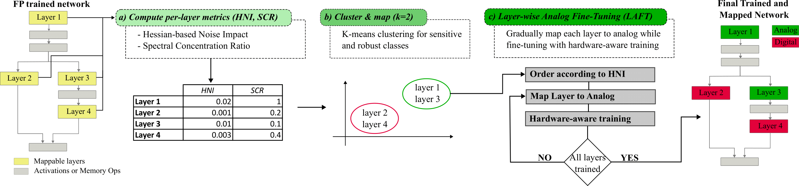

# HILAL: Hessian-Informed Layer Allocation for Heterogeneous Analog–Digital Inference

<div align="center">
  
</div>

Source code for the framework introduced in our paper:  
**"HILAL: Hessian-Informed Layer Allocation for Heterogeneous Analog–Digital Inference"**  
Submitted to the *DATE Conference 2026*.

---

## Abstract

Heterogeneous AI accelerators that combine high-precision digital cores with energy-efficient analog in-memory computing (AIMC) units offer a promising path to overcome the energy and scalability limits of deep learning.  
A key challenge, however, is to determine which neural network layers can be executed on noisy analog units without compromising accuracy. Existing mapping strategies rely largely on **ad-hoc heuristics** and lack principled noise-sensitivity estimation.  
We propose **HILAL (Hessian-Informed Layer Allocation)**, a framework that systematically quantifies layer robustness to analog noise using two complementary metrics:  
- **Noise-aware Expected Loss Increase**  
- **Spectral concentration (eigenvalue ratio)**  

Layers are then partitioned into *robust* and *sensitive* groups via clustering, enabling **threshold-free mapping** to analog or digital units. To further mitigate accuracy loss, we gradually offload layers to AIMC while retraining with noise-injection.  

**Results:**  
Experiments on convolutional networks (*AlexNet, VGG-16, ResNet-8, ResNet-50*) and transformers (*ViT-B/16, MobileBERT*) across **CIFAR-10, CIFAR-100, and SQuAD v1.1** show that HILAL achieves:  

- **3.09× faster search & mapping runtime** than state-of-the-art methods  
- **Higher analog utilization** while preserving accuracy  
- **Lower accuracy degradation** across all tested models  

---

## Installation

Clone this repository and install in development mode:

```
pip install -e .
```

Note: `aihwkit` is required. See https://aihwkit.readthedocs.io/en/latest/install.html for complete installation instructions.

## Examples

Full examples can be found [here](examples/):

| Model      | Dataset              | Script                                            |
| ---------- | -------------------- | ------------------------------------------------|
| ResNet-8   | CIFAR-10 / CIFAR-100 | [Available here](examples/resnet8_cifar10.py)   |
| ResNet-20  | CIFAR-10 / CIFAR-100 | [Available here](examples/resnet8_cifar10.py)   |
| AlexNet    | CIFAR-10 / CIFAR-100 | [Available here](examples/resnet8_cifar10.py)   |
| VGG-16     | CIFAR-10 / CIFAR-100 | [Available here](examples/resnet8_cifar10.py)   |
| MobileBERT | SQuAD v1.1           | [Available here](examples/resnet8_cifar10.py)   |
| ViT-B/16   | ImageNet             | [Available here](examples/resnet8_cifar10.py)   |

Checkpoints: The checkpoint for the ResNet20 model for example can be generated using this [script](examples/train_resnet20.py). When instantiating MobileBERT and ViT-B/16, pre-trained floating-point weights are automatically fetched and loaded.